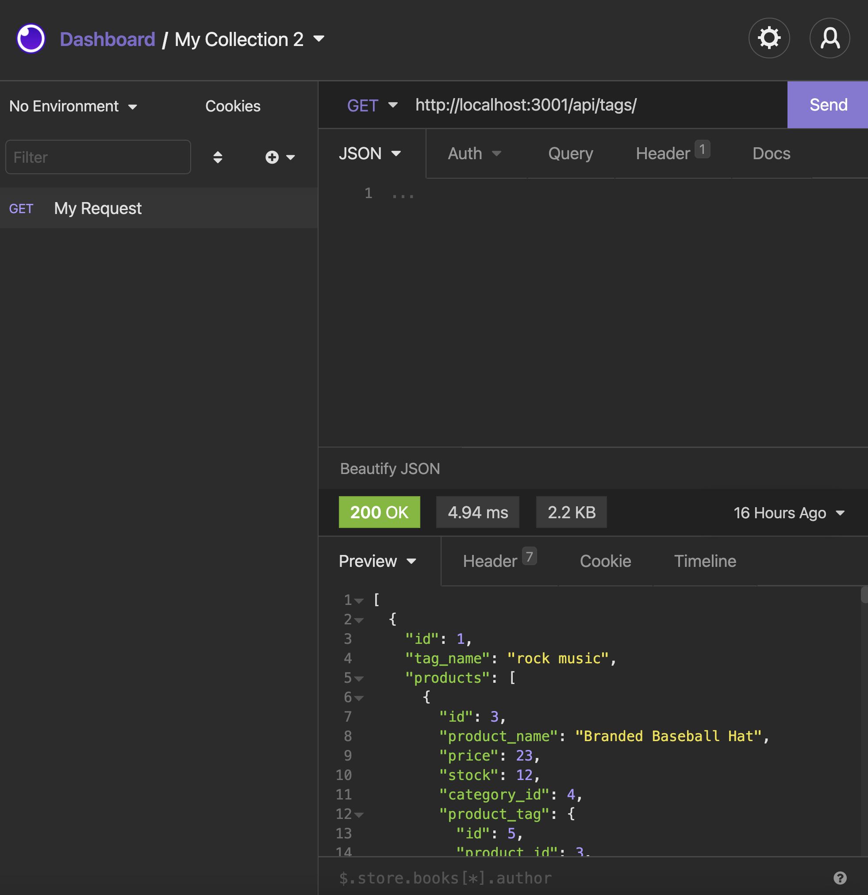

# E-Commerce Back-End
 This is the back end for an e-commerce site taht was made by  modifying starter code given. It works with Express.js API and Sequelize to interact with a MySQL database. Finally, this application uses Insominia to test the different routes found in this application. You will be able to find the following routes for Category, Tag, Product:
 
 1. GET see all or just 1 object (row).
 2. POST create a new row in the database.
 3. PUT update selected row with its id. 
 4. DELETE remove a selected row from the database using its id.


   ## Table of Contents 

  - [Installation](#installation)
  - [Usage](#usage)
  - [License](#license)
  - [How to Contribute](#contribute)
  - [Questions](#questions)

<br/>
<br/>
  
  ## Installation
  ```zsh
  npm install
  ```
  ## Usage
  Invoke the application with the command: 
  ```zsh
npm start
  ```
 See an example of a get route to see all of the tags.


<p align="center">
  
</p>
  

  ## Contribute
  If you would like to contribute please contact me.
  ## Walkthough
 https://watch.screencastify.com/v/2y4fDeNJd0XVhdtBKAP1
 https://watch.screencastify.com/v/epAs1eeVyxPtxOkNeq30
  ## Questions
  To reach me please contact me in the email address below.

  - GitHub: https://github.com/KarenHarley
  - Email: karenharley88@gmail.com
    
    
  
